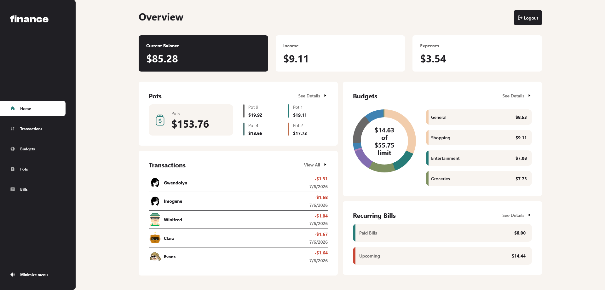

# Personal Finance App

Personal Finance App is a fullstack web application developed as part of a challenge on [Frontend Mentor](https://www.frontendmentor.io/challenges/personal-finance-app-JfjtZgyMt1). The app provides a platform for users to manage their budgets, pots, transactions and bills.

## App features

- **Expense and income management**
- **Budget and pot management**
- **Transaction and bill management**
- **Sort transactions and bills**
- **OAuth integrations with Google and GitHub**
- **JWT + refresh-token-based authentication with email and password**

## Technologies used

- ### Frontend
  - React
  - TanStack Router
  - TanStack Query
  - Radix UI
  - Playwright
  - TypeScript
  - Vite
  - Vitest
  - Zod
  - Zustand

- ### Backend
  - ASP.NET - Minimal API
  - Entity Framework Core
  - xUnit with TestContainers
  - PostgreSQL

- ### Deployment
  - Docker
  - GitHub Actions
  - Microsoft Azure Container Apps

## Demo login credentials

To see the demo with pre-filled data, you can log in with the following credentials:

- **Email**: `Melisa.Rutherford@hotmail.com`
- **Password**: `password`

Or you can log in with the guest account which does not require credentials.

## Screenshots



## Getting Started

Clone the repository:

```bash
git clone https://github.com/nghuthjo/personal-finance-app.git
```

### Frontend

Change current working directory first before running the commands after it:

```bash
cd frontend
```

Install dependencies:

```bash
npm install
```

Start the development server:

```bash
npm run dev
```

Build for production:

```bash
npm run build
```

### Backend

Change current working directory first before running the commands after it:

```bash
cd backend/src
```

Run the development server:

```bash
dotnet run
```

Pubilsh

```bash
dotnet publish -c Release -o /release
```

## Acknowledgements

This project was developed based on this challenge from [Frontend Mentor](https://www.frontendmentor.io/challenges/personal-finance-app-JfjtZgyMt1), using other deployed solutions of this project as design and style reference since I did not have access to the Figma design files.
